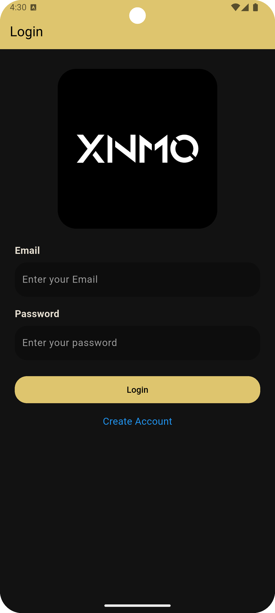
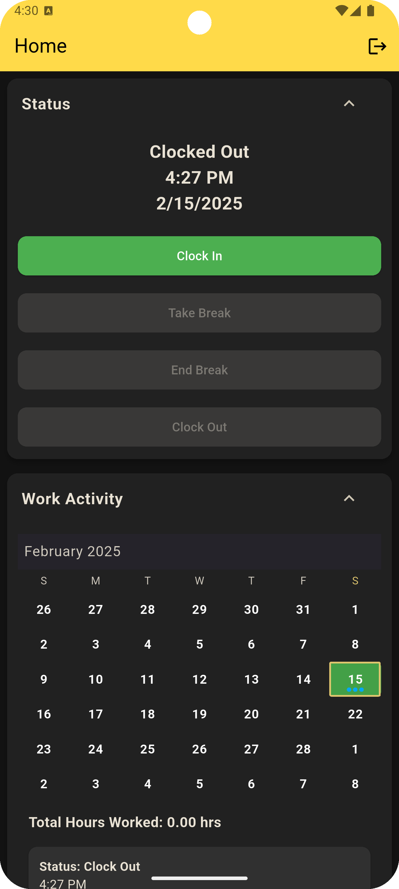

# XNMO - Employee Clock-In System

XNMO is a Flutter-based employee time-tracking app that allows users to clock in, take breaks, and clock out while logging timestamps and GPS coordinates in Firebase Firestore.

---

## 🚀 Features
- ✅ Clock In & Out – Tracks clock-ins, breaks, and clock-outs with timestamps.
- ✅ GPS Logging – Stores user location during clock-in/out for verification.
- ✅ Real-Time Status Updates – Displays the latest work status with timestamps.
- ✅ Shimmer Loading Effects – Smooth loading animations while fetching data.
- ✅ Work History & Analytics – Users can view logged hours and break times in an interactive Activity Card.
- ✅ Embedded Maps – Displays clock-in/out locations using OpenStreetMap.
- ✅ Firestore Integration – All work logs are stored & synced in real-time.

---

## 📸 Screenshots

| Login | Home Screen |
|-------|------------|
|  |  |


---

## 📥 Installation

### 1️⃣ Clone the repository:

```sh
git clone https://github.com/yourusername/xnmoapp.git
cd xnmoapp
```

### 2️⃣ Install dependencies:

```sh
flutter pub get
```

### 3️⃣ Setup Firebase:

- Create a Firebase project in the Firebase Console
- Enable Authentication (Email/Password)
- Setup Cloud Firestore
- Add `google-services.json` (Android) and `GoogleService-Info.plist` (iOS)

### 4️⃣ Run the app:

```sh
flutter run
```

---

## ⏳ Usage

### Clocking In & Out
- Users tap the Clock In button from the Home Screen.
- Status updates to "Clocked In" with a timestamp and GPS location.
- Users can tap "Take Break" to log a break.
- The system records the timestamp and pauses work tracking.
- Pressing "End Break" resumes tracking.
- Users tap "Clock Out" to finish their work session.
- A new entry is stored in Firestore with:
- Start Time (Clock In)
- End Time (Clock Out)
- Break Duration
- Total Worked Hours (calculated automatically)
- Users can view their work history in the Activity Card.
- Maps display locations of clock-ins and clock-outs.
- Total work hours for the selected day are calculated dynamically.
- 🚀 All data is synced in real-time using Firebase Firestore.

### Admin Features
- Admins can be manually assigned in Firestore (`isAdmin: true`).
- Admins can access advanced reports (feature in progress).

---

## 🛠️ Tech Stack

- **Flutter (Dart)**
- **Firebase Authentication**
- **Cloud Firestore**
- **Geolocator (GPS tracking)**
- **Shimmer (UI loading effects)**
- **Intl (Date formatting)**

---

## 📂 Folder Structure

```bash
/xnmoapp
  ├── lib/
 │   ├── main.dart                      # Entry point of the app
 │
 │   ├── enum/                           # Enums for managing app states
 │   │   ├── work_status_enum.dart       # Enum for work status values
 │
 │   ├── objects/                        # Data models & sources
 │   │   ├── work_logs.dart              # Work log model
 │   │   ├── work_data_source.dart       # Data source for work logs
 │
 │   ├── repositories/                   # Repositories for handling data access
 │   │   ├── firestore_repository.dart   # Firestore data handling
 │   │   ├── map_repository.dart         # Handles map widget retrieval
 │
 │   ├── reusable_components/            # Reusable UI components
 │   │   ├── expandable_card.dart        # Expandable card component
 │
 │   ├── screens/                        # Main screens of the app
 │   │   ├── homescreen_screen.dart      # Home screen
 │   │   ├── login_screen.dart           # Login screen
 │   │   ├── signup_screen.dart          # Signup screen
 │   │   ├── splash_screen.dart          # Splash screen
 │
 │   ├── services/                       # Service layer for external dependencies
 │   │   ├── firestore_service.dart      # Firestore API service
 │   │   ├── location_service.dart       # GPS location tracking service
 │   │   ├── map_service.dart            # Generates map tile URLs
 │
 │   ├── view_models/                    # View models for state management (Provider)
 │   │   ├── activity_view_model.dart    # Manages work activity logs & total hours
 │   │   ├── status_view_model.dart      # Manages work status tracking
 │
 │   ├── widgets/                        # UI Widgets
 │   │   ├── activity_card.dart          # Displays work activity logs
 │   │   ├── status_card.dart            # Displays current clock-in status
```

---

## 🔮 Roadmap

- 🚀 **Admin Dashboard** (Web-based analytics for managers)

---

## 📜 License

This project is licensed under the MIT License.

---

## 🙌 Contributing

We welcome contributions! Feel free to submit a pull request or open an issue.

---

## 💡 Contact

For inquiries or issues, feel free to reach out via GitHub Issues.

